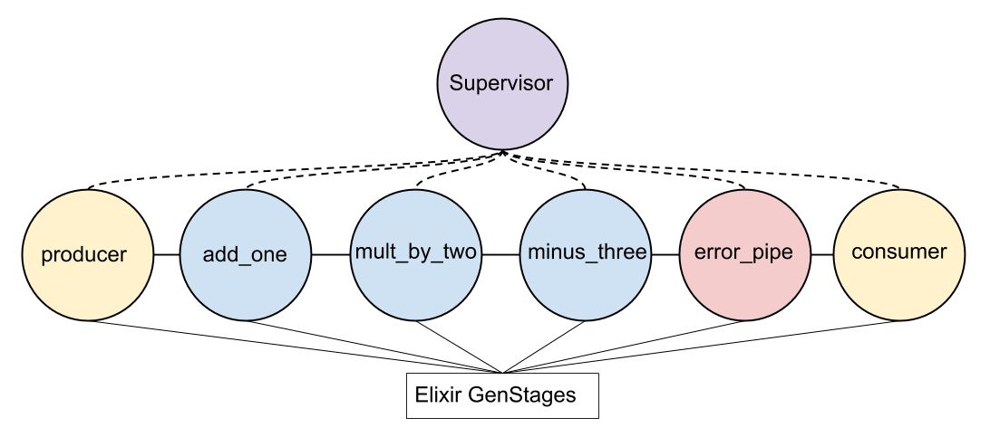
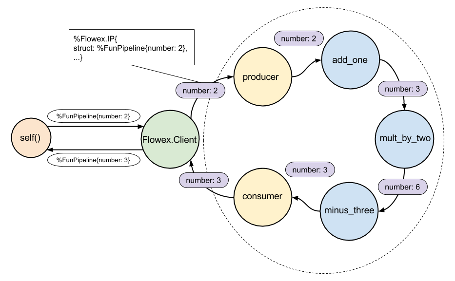
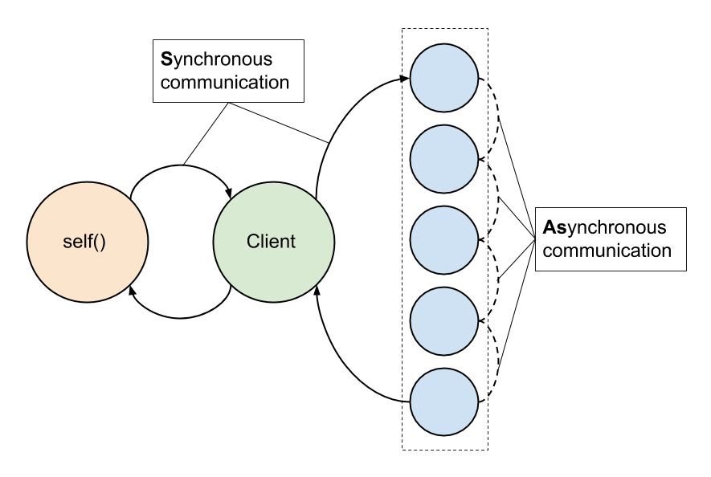
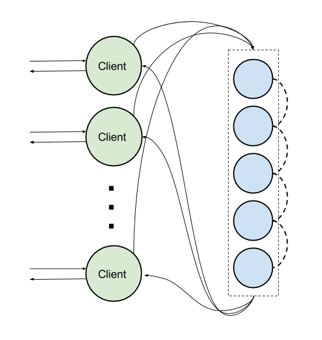

# Flowex
[](https://travis-ci.org/antonmi/flowex)
[](https://hex.pm/packages/flowex)

## Railway Flow-Based Programming with Elixir GenStage.
#### Flowex is a set of abstractions build on top Elixir GenStage which allows writing program with [Flow-Based Programming](https://en.wikipedia.org/wiki/Flow-based_programming) paradigm.
I would say it is a mix of FBP and so-called [Railway Oriented Programming (ROP)](http://fsharpforfunandprofit.com/rop/) approach.

Flowex DSL allows you to easily create "pipelines" of Elixir GenStages.
#### Dedicated to my lovely girlfriend Chryścina.

## Contents
- [A simple example to get the idea](#a-simple-example-to-get-the-idea)
- [More complex example for understanding interface](#more-complex-example-for-understanding-interface)
- [Flowex magic!](#flowex-magic!)
- [Run the pipeline](#run-the-pipeline)
- [How it works](#how-it-works)
- [Synchronous and asynchronous calls](#synchronous-and-asynchronous-calls)
- [Bottlenecks](#bottlenecks)
- [Module pipelines](#module-pipelines)
- [Contributing](#contributing)

## A simple example to get the idea
Let's consider a simple program which receives a number as an input, then adds one, then multiplies the result by two and finally subtracts 3.

```elixir
defmodule Functions do
  def add_one(number), do: number + 1
  def mult_by_two(number), do: number * 2
  def minus_three(number), do: number - 3
end

defmodule MainModule do
  def run(number) do
    number
    |> Functions.add_one
    |> Functions.mult_by_two
    |> Functions.minus_three
  end
end
```
So the program is a pipeline of functions with the same interface. The functions are very simple in the example.

In the real world they can be something like `validate_http_request`, `get_user_from_db`, `update_db_from_request` and `render_response`.
Furthermore, each of the function can potentially fail. But for getting the idea let's stick the simplest example.

FBP defines applications as networks of "black box" processes, which exchange data across predefined connections by message passing.

To satisfy the FBP approach we need to place each of the function into a separate process. So the number will be passed from 'add_one' process to 'mult_by_two' and then 'minus_three' process which returns the final result.

That, in short, is the idea of Flowex!

## More complex example for understanding interface
Let's define a more strict interface for our function. Flowex uses the same approach as [Plug](https://github.com/elixir-lang/plug).
So each of the function must receive a predefined struct as a first argument and return the struct of the same type:

```elixir
def add_one(struct, opts) do
  new_number = struct.number + 1
  %{struct | number: new_number, a: opts.a}
end
```
The function receives a structure with `number` and `a` fields and returns modified structure or the same type.
The second argument is a set of options and will be described later.
Let's rewrite the whole `Functions` module in the following way:
```elixir
defmodule Functions do
  defstruct number: nil, a: nil, b: nil, c: nil

  def add_one(struct, opts) do
    new_number = struct.number + 1
    %{struct | number: new_number, a: opts.a}
  end

  def mult_by_two(struct, opts) do
    new_number = struct.number * 2
    %{struct | number: new_number, b: opts.b}
  end

  def minus_three(struct, opts) do
    new_number = struct.number - 3
    %{struct | number: new_number, c: opts.c}
  end
end
```
The code is more complex but more solid. The module defines three functions with the same interface.
We also defined as struct `%Functions{}` which defines a data-structure being passed to the functions.

## Flowex magic!
Let's add a few lines at the beginning.
```elixir
defmodule FunPipeline do
  use Flowex.Pipeline

  pipe :add_one
  pipe :mult_by_two
  pipe :minus_three

  defstruct number: nil, a: nil, b: nil, c: nil

  def add_one(struct, opts) do
    new_number = struct.number + 1
    %{struct | number: new_number, a: opts.a}
  end

  # mult_by_two and minus_three definitions skipped
end
```
We also renamed the module to `FunPipeline` because we are going to create "Flowex pipeline".
`Flowex.Pipeline` extend our module, so we have:
- `pipe` macros to define which function evaluation should be placed into separate GenStage;
- `start` and `stop` functions to create and destroy pipelines;
- `run` function to run pipeline computations.

Let's start a pipeline:
```elixir
opts = %{a: 1, b: 2, c: 3}

pipeline = FunPipeline.start(opts)

#returns
%Flowex.Pipeline{in_name: :"Flowex.Producer_#Reference<0.0.7.504>",
 module: FunPipeline, out_name: :"Flowex.Consumer_#Reference<0.0.7.521>",
 sup_pid: #PID<0.136.0>}
```
What happened:
- Three GenStages were started - one for each of the function in pipeline. Each of GenStages is `:producer_consumer`;
- Runs 'producer' and 'consumer' GenStages for input and output;
- All the components are placed under Supervisor.

The next picture shows what the 'pipeline' is.


The `start` function returns a `%Flowex.Pipeline{}` struct with the following fields:
- module - the name of the module
- in_name - unique name of 'producer';
- out_name - unique name of 'consumer';
- sup_pid - pid of the pipeline supervisor

Note, we have passed options to `start` function. This options will be passed to each function of the pipeline as a second argument.

## Run the pipeline
There are two ways of running calculations:

`FunPipeline.run/2` function receive a `%Flowex.Pipeline{}` struct as a first argument and must receive a `%FunPipeline{}` struct as a second one.
The `run` function returns a %FunPipeline{} struct.

```elixir
FunPipeline.run(pipeline, %FunPipeline{number: 2})
# returns
%FunPipeline{a: 1, b: 2, c: 3, number: 3}
```

As expected, pipeline returned `%FunPipeline{}` struct with `number: 3`. `a`, `b` and `c` were set from options.

Another way is using `Flowex.Client` module which implements GenServer behavior.
The `Flowex.Client.start\1` function receives pipeline struct as an argument.
Then you can use `run/2` function. See example below:
```elixir
{:ok, client_pid} = Flowex.Client.start(pipeline)

Flowex.Client.run(client_pid, %FunPipeline{number: 2})
# returns
%FunPipeline{a: 1, b: 2, c: 3, number: 3}
```
## How it works
The following figure demonstrates the way data follows:

The things happen when you call `Flowex.Client.run`:
- `self` process makes synchronous call to the client gen_server with `%FunPipeline{number: 2}` struct
- the client makes synchronous call 'FunPipeline.run(pipeline, %FunPipeline{number: 2})'
- the struct is wrapped into `%Flowex.IP{}` struct and begins its asynchronous journey from one GenStage to another
- when the consumer receives the Information Packet (IP), it sends it back to the client which sends it back to the caller process.

## Synchronous and asynchronous calls
Note, that `run` function on pipeline module or `Flowex.Client` is synchronous. While communication inside the pipeline is asynchronous:

In order to send a large number of IP's and process them in parallel one can use several clients connected to the pipeline:


## Bottlenecks
Each component of pipeline takes a some to finish IP processing. One component does simple work, another can process data for a long time.
So if several clients continuously push data they will stack before the slowest component. And data processing speed will be limited by that component.

Flowex has a solution! One can define a number of execution processes for each component.
```elixir
defmodule FunPipeline do
  use Flowex.Pipeline

  pipe :add_one, 1
  pipe :mult_by_two, 3
  pipe :minus_three, 2

  # ...
end
```
And the pipeline will look like on the figure below:


## Module pipelines
One can create reusable 'pipe' - module which implements init and call functions.
```elixir
defmodule ModulePipeline do
  use Flowex.Pipeline

  defstruct number: nil, a: nil, b: nil, c: nil

  pipe AddOne, 1
  pipe MultByTwo, 3
  pipe MinusThree, 2
end

#pipes

defmodule AddOne do
  def init(opts) do
    %{opts | a: :add_one}
  end

  def call(struct, opts) do
    new_number = struct.number + 1
    %{struct | number: new_number, a: opts.a}
  end
end

defmodule MultByTwo do
  def init(opts) do
    %{opts | b: :mult_by_two}
  end

  def call(struct, opts) do
    new_number = struct.number * 2
    %{struct | number: new_number, b: opts.b}
  end
end

defmodule MinusThree do
  def init(opts) do
    %{opts | c: :minus_three}
  end

  def call(struct, opts) do
    new_number = struct.number - 3
    %{struct | number: new_number, c: opts.c}
  end
end
```
Of course, one can combine module and functional 'pipes'!

## Contributing
#### Contributions are welcome and appreciated!

Request a new feature by creating an issue.

Create a pull request with new features or fixes.

Flowex is tested using ESpec. So run:
```sh
mix espec
```
